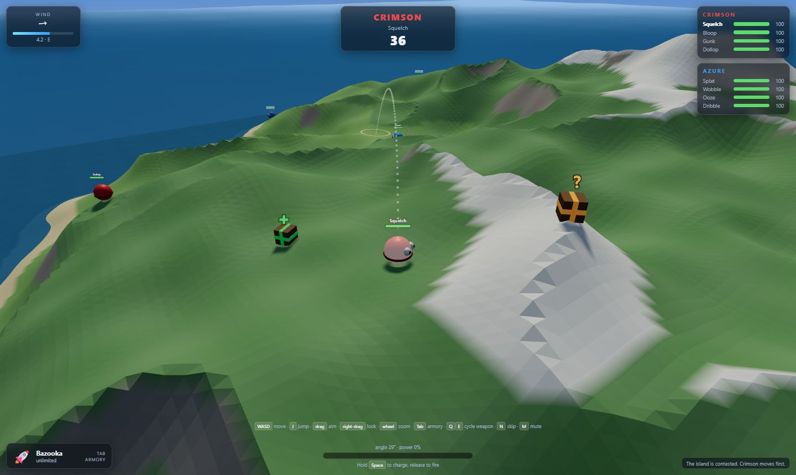

# Blob War 3D

A turn-based artillery game in the spirit of *Worms*, in 3D, built with [three.js](https://threejs.org/).
Two squads of four blobs take turns lobbing explosives at each other across a big
procedurally generated island. Sixteen weapons, supply crates parachuting in every
turn, and fully destructible ground — craters stay, and a deep enough one floods with
seawater. Last team wobbling wins.



## Running it

```bash
npm install
```

```bash
npm run dev
```

Then open http://localhost:5173. `npm run build` produces a static bundle in `dist/`.

### Playing online

Build once, then run the game server (it serves the page *and* the socket on one port):

```bash
npm run online
```

That's http://localhost:3000 — enough for anyone on your LAN. To let a friend on the
internet in you need `cloudflared` once:

```bash
winget install --id Cloudflare.cloudflared
```

Then open a tunnel in a second terminal, leaving the server running:

```bash
npm run tunnel
```

It prints a public `https://…trycloudflare.com` URL. Share it, and everyone picks **PLAY
ONLINE** → one person **hosts** and reads out the four-character room code, the rest
**join with code**. 2 to 4 players, one squad each; the host starts the match.

The tunnel is the easy path on purpose: no port forwarding, no dynamic DNS, no
certificate. It matters that it's HTTPS — a secure page cannot open a plain `ws://`
socket, so a raw port-forward would need a real TLS certificate on your home IP. (LAN play
over `http://192.168.x.x:3000` is fine as-is, since an insecure origin may use `ws://`.)

## Playing

| Action | Control |
| --- | --- |
| Move | `W` `A` `S` `D` (camera-relative) |
| Jump | `J` or `Shift` — goes where you're steering, or where you're facing if you're standing still |
| Aim | drag with the left mouse button — horizontal turns, vertical raises the shot |
| Free look | drag with the right mouse button, `C` recenters |
| Zoom | mouse wheel |
| Fire | hold `Space` to charge — power bounces between min and max — release to launch |
| Armory | `Tab` opens the weapon menu · `Q`/`E` cycle · `1`–`9` quick slots |
| Map | `M` opens the full map · `Tab` swaps top-down for 3D orbit |
| Skip turn | `N` |
| Mute | `K` |

A jump clears about four units of height and covers seven of ground, which is the way
past a slope too steep to walk up (`CFG.blob.maxClimb`) and out of a crater you've been
knocked into. It lands just under the fall-damage threshold, so hopping on the flat is
free — hopping off a ledge is not.

A dotted arc previews where the current shot lands, wind and all, with a ring marking
the impact point. Wind is re-rolled every turn and pushes the bazooka hard, the grenade
barely at all. Opening the armory pauses the turn clock.

### The map

A small top-down chart of the island sits under the wind gauge, coloured the same way
as the ground itself — sand, grass, rock, snow, depth-shaded sea — with a dot per living
blob, squares for supply crates, and a wedge showing where the camera is pointing.
Craters appear on it as they're blown.

`M` (or clicking the corner map) opens it full screen, in either of two modes:

- **Top-down** — the same chart, scrollable and zoomable from the whole island up to 8×.
  Drag or use `WASD` to pan, the wheel to zoom. Blobs get health bars, and there's a
  compass and a scale bar. Past 2.5× it stops interpolating and shows the real heightmap
  cells, which is the resolution craters are actually carved at.
- **3D orbit** — the live scene rendered from a camera circling high above the island.
  Drag or `A`/`D` to swing it around, `W`/`S` to change the elevation, wheel to pull in
  and out. Every blob gets a team-coloured beacon so you can pick them out from 350 units up.

`Tab` switches modes, `Esc` or `M` closes. Like the armory, the map pauses the turn clock.

From the main menu: **Local game** (2–4 squads, against the computer or hotseat) or
**Play online** (2–4 players, one squad each). `Esc` pauses. Four squads means three blobs
each instead of four, so the island doesn't get overcrowded.

Both setup screens also pick the **map** (four terrain presets — Archipelago, Highlands,
Flatlands, Atoll — see `src/maps.js`), **gravity** (Low/Normal/High), and which
**weapons** are in play; Bazooka and Grenade have infinite ammo and can't be turned off.
Online, only the host's choices matter — joining a room just plays whatever they picked.

The map picker's fifth slot is a **map editor**: paint a heightmap by hand — five
brush heights from open sea to snowy peak, a brush size, a "randomize" button that
drops in a fresh procedural island to start from — and every match still layers its
own random noise on top at the strength you set, so no two playthroughs of a
hand-painted map look identical. One map is saved locally at a time (edit or replace
it any time from its card); playing it online sends the painted heightmap to every
guest so the terrain matches exactly. See `src/customMap.js` (storage + the
Terrain-consumable definition) and `src/mapEditorCanvas.js` (the brush and paint-canvas
rendering).

**Practice Range**, on the title screen, drops you alone onto a flat, wide-open version
of the island with every weapon unlocked and unlimited ammo. There's no opponent, no
turn clock, no way to die (a floor keeps health at 1, and the water can't drown you) —
after each shot the same blob just gets another go, so it's built purely for getting a
feel for how each weapon behaves and how the controls work.

### Weapons

Sixteen of them, browsable with `Tab`. Ammo is per team and shared across the squad.

**Launchers** — aimed arcs.

| | Ammo | Notes |
| --- | --- | --- |
| Bazooka | ∞ | Big blast, fully exposed to wind. |
| Homing Missile | 2 | Locks onto the enemy you point it at and steers after 0.6s. |
| Mortar | 3 | Modest blast that kicks five shards straight back up. |
| Cluster Bomb | 3 | Bursts into six bomblets. |
| Firebomb | 2 | Scatters eleven embers over a wide patch. |

**Throwables** — bouncy and/or planted.

| | Ammo | Notes |
| --- | --- | --- |
| Grenade | ∞ | Bounces, three second fuse. |
| Fruit Bomb | 2 | Splits into five bouncing fruitlets. |
| Sacred Melon | 1 | 115 damage, 14-unit blast. Take cover. |
| Dynamite | 3 | Planted at your feet, four seconds to run. |
| Land Mine | 4 | Arms after 2.5s, then waits — *between turns too*. |

**Firearms** — flat, fast, barely affected by gravity.

| | Ammo | Notes |
| --- | --- | --- |
| Scattergun | 4 | Two shots per pickup; the turn doesn't end until you fire both. |
| Uzi | 3 | Ten rounds in a spread burst. |

**Airborne** — delivered onto your aim marker from above.

| | Ammo | Notes |
| --- | --- | --- |
| Air Strike | 2 | Five bombs walked across the marker. |
| Iron Mule | 1 | One very heavy animal. Leaves the biggest hole in the game. |

**Utility**

| | Ammo | Notes |
| --- | --- | --- |
| Baseball Bat | 3 | Melee. Launches anything in front of you a very long way. |
| Teleport | 3 | Blink to wherever the marker is resting. |

### Supply drops

Most turns open with a crate parachuting onto a random flat spot. Walk a blob into one
to collect it.

- **Medkits** (green, ✚) restore 35 health. They're more likely to appear when somebody
  on the field is hurt.
- **Weapon crates** (orange, ?) hand your team extra ammo, weighted so the Sacred Melon
  and Iron Mule stay rare.

Crates are also targets: shoot a weapon crate and it cooks off like a mine. The computer
will waddle over to grab a crate within reach before it takes its shot.

### Sudden death

If a match reaches 60 turns, every surviving blob is knocked down to 25 health and the
sea starts climbing half a metre a turn. Low ground floods, crates and mines sink, and
the island shrinks until somebody wins. Without it two evenly matched squads collecting
medkits can heal about as fast as they take damage — an AI-vs-AI test found one match
still going at 343 turns.

### Ways to die

Damage, obviously — but also drowning (knocked below sea level), fall damage from a
long drop, standing on ground somebody blows out from under you, wandering into your own
land mine, and standing next to a weapon crate when it gets shot. A blob that hits zero
health explodes, which can set off a chain reaction.

## How it works

```
server/
  index.js       online relay: rooms, slots, message forwarding. Runs no simulation.
src/
  main.js        renderer, sky, sun, ocean, the frame loop
  game.js        turn state machine, damage/knockback, aim preview, win condition
  menu.js        title, local setup, host/join, lobby, pause
  minimap.js     corner chart, the full-screen map and its 3D orbit camera
  net.js         client socket and the session object Game talks to
  rng.js         seeded generator for everything that changes an outcome
  weapons.js     the weapon registry — all sixteen, as data
  terrain.js     heightmap island: generation, sampling, and crater carving
  maps.js        map presets (terrain-shape params) the setup menu picks from
  customMap.js   the one hand-painted map: storage, and its Terrain definition
  mapEditorCanvas.js  paint-brush math and the editor's paint-canvas rendering
  heightmapImage.js   shared band+hillshade colouring for the minimap and map thumbnails
  blob.js        blob entity — walking, ballistics, health, face and name label
  projectile.js  shots in flight + the headless trajectory integrator
  mine.js        planted mines, which outlive the turn that placed them
  crate.js       parachuted supply drops and their loot table
  ai.js          computer opponent's firing solution search
  cameraRig.js   orbit camera that doubles as the aiming device
  fx.js          explosions, debris, smoke, splashes, damage numbers
  hud.js         DOM overlay, including the armory panel
  audio.js       procedurally synthesised sound (no audio assets)
  input.js       keyboard/mouse state
  noise.js       seeded PRNG + Perlin noise
  config.js      all gameplay tuning constants
```

A few decisions worth knowing about if you want to modify it:

**Weapons are data, not classes.** `weapons.js` is one big registry; `Projectile` and
`Game.fire()` read fields off it (`delivery`, `detonate`, `bounce`, `homing`, `children`,
`burst`, `shots`, `retreat`) rather than branching on weapon ids. Adding a weapon is
usually just another entry — a bouncing bomb that splits into six smaller bouncing bombs
is about twelve lines. Munitions spawned by other weapons are marked `internal: true` so
they never appear in the armory.

**The sea is three meshes, not one.** Only the middle 1800 units of ocean are animated;
around it sit a static annulus of water and a flat "abyss" sheet at the height the
island's outer rim bottoms out to, both running well past the fog. Without them you can
see where the world stops the moment you leave ground level — the heightmap's square rim
reads as a shelf through the water, and the waves end in mid-sea. The annulus has a
square hole cut exactly to the animated plane and shares its material: no overlap, so two
translucent sheets never blend twice and print the seam they exist to hide.

**Terrain is a heightmap, not voxels.** `Terrain.carve()` pushes every vertex inside the
blast sphere down to the bottom of that sphere, never up. That gives real craters and
keeps collision to a bilinear height lookup, but it means no overhangs or caves — a
blast at the foot of a cliff shears the cliff top off rather than tunnelling through it.

**Carving never recomputes vertex normals.** The terrain material is flat-shaded, so the
fragment shader derives normals from screen-space derivatives and the normal attribute is
only used for shadow bias. On a 280×280 heightmap (~79k vertices) recomputing them per
crater would cost more than the entire rest of the frame. That's what makes a map this
size affordable.

**Mines and crates live outside the turn state machine.** The "wait until everything stops
moving" check that ends a turn watches the projectile list, so anything designed to sit
around between turns can't be a projectile. They get their own lists and are ticked every
frame regardless of phase.

**Blobs have two movement modes.** Grounded, they walk snapped to the surface and refuse
slopes steeper than `CFG.blob.maxClimb`. Airborne — jumping, knockback, or the ground
vanishing beneath them — they're plain ballistic bodies until they land.

**The aim preview and the AI share one integrator.** `simulateTrajectory()` in
`projectile.js` is a headless copy of the projectile physics, so the dotted arc you see
is what the shot actually does, and the AI searches for shots using the same function.
It solves by brute force: a coarse pitch/power grid, then local refinement, then a
skill-scaled random error so it isn't a perfect sniper. Tune it via the `skill` argument
to `planShot` (default `0.72`).

**The simulation runs on a fixed 1/60 timestep**, rendering on real frame time. That makes
the game frame-rate independent (verified identical at 30/60/144 fps) and is what lets
online clients agree without auditing every float — projectile and blob physics use only
`+ - * /` and `sqrt`, which IEEE 754 pins down exactly, so the same inputs and the same
timestep give the same answer on any machine.

**Online is actor-authoritative.** Whoever's turn it is simulates it and publishes a ~1 KB
snapshot when the turn ends; everyone else watches live and reconciles. Craters replay as a
16-byte list rather than shipping the heightmap. There's a terrain checksum on every
snapshot and a full-heightmap resync behind it, but in normal play it never fires. Cheating
is possible by design — the acting client reports its own damage — which is fine for
playing with friends. See [docs/multiplayer-plan.md](docs/multiplayer-plan.md), including
the four desync bugs that only showed up with two real clients running.

**The map is drawn from the heightmap, not from a render.** `minimap.js` bakes the island
into a 281×281 offscreen canvas — one texel per world unit, coloured by the same
`Terrain.bandAt()` the ground shader uses, plus a hillshade lit from where the sun
actually is. Per frame it's one scaled `drawImage` and a handful of markers. The bake is
redone only when `Terrain.revision` changes (a crater) or the sea moves, throttled to
five times a second, because craters land in bursts. The 3D mode is not a second render
target: it renders the same scene from an orbiting camera *instead of* the play camera,
with its own fog, since the play fog would haze over an island viewed from 350 units up.

**Everything else gameplay-related is in `config.js`** — map size, gravity, turn length,
wind strength, crate drop rate, team names and colours, blobs per team, and `maxTeams`
(add a team definition to `CFG.teams` to allow more than four).

## Requirements

Node 18+ and a browser with WebGL2. No other dependencies beyond three.js and Vite.
